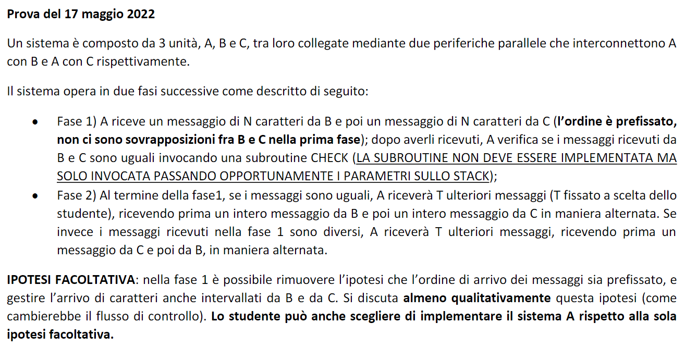

# 3node-PIAcommunication
Assembler programming on Motorola 68k of three nodes, each with a CPU, memory/bus and at least one PIA, communicating with each other as explained in the homework png.

In order to assembly this project i used ASIM tool and to simulate ASIM, both Unina proprietary software.